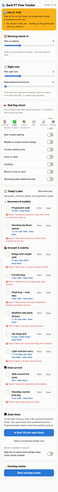
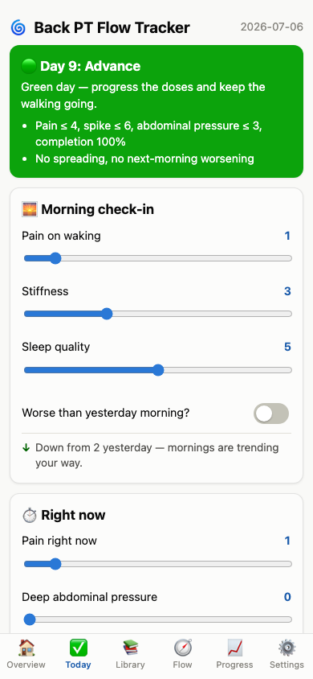
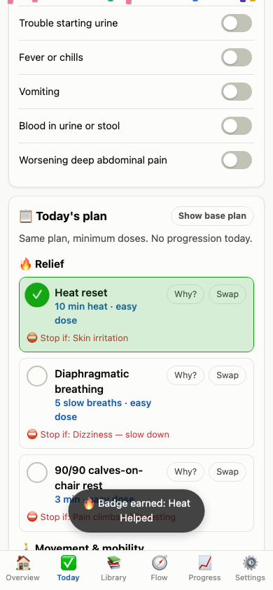
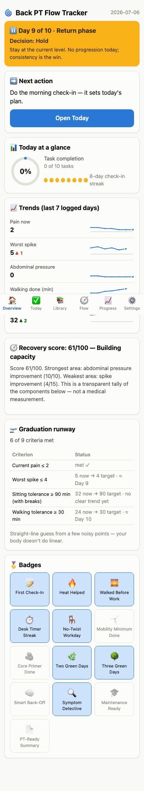
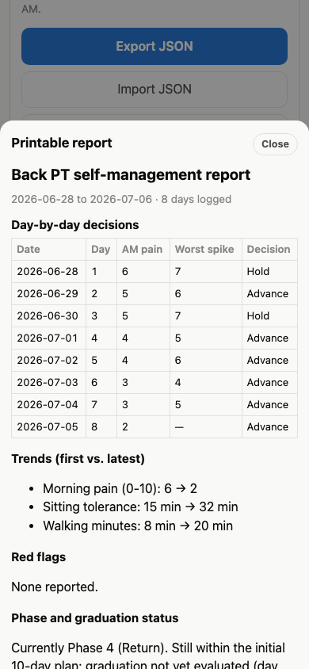
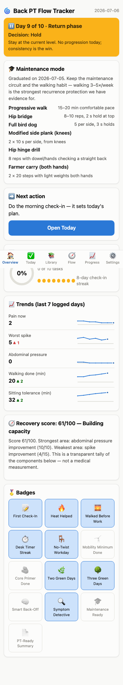

# Reverie session — pt-progression, 2026-07-06

Audit-first session on user direction: the newly installed plugins (code-simplifier, security-guidance, typescript-lsp, pr-review-toolkit) drove a 14-agent audit of main **and** all 8 unmerged branches from session 20260705-0034, whose 49 findings became 3 hardening branches + 8 polish commits; Phase B then built all 5 "promising but unbuilt" ideas from that session's queue. **16/16 attempts accepted** (3 A's, 13 B's), **16 PRs raised and independently reviewed on GitHub** (a session first — user-authorized), ~3.30M journaled tokens. Most interesting outcome: the data-safety branch closed a real silent-data-loss chain, and the new-episode-archive feature finally admits relapse exists. Biggest process issue: three separate builders wrote e2e assertions on the same known-racy toast surface they were forbidden from discovering (briefs now must enumerate flaky surfaces); the session also absorbed a multi-hour token-pause suspension mid-flight (user-granted continuation) and two builder API stalls (respawned in-place, no work lost).

**Session:** 00:21–~12:00 (6h budget; suspended mid-flight by a usage pause, resumed on user grant) · **Focus:** audit-first with new plugins; then the unbuilt-ideas queue; PRs + reviews; aggressive parallelism
**Attempts:** 16 · **Shipped:** 16 · **Abandoned:** 0 · **Ideas left in queue:** 3 · **Total spend:** 3,299,551 tokens

All 16 branches are also **open PRs (#1–#16) on itsOrD/pt-progression**, each with an independent posted review (14 merge-ready/no findings; PR#9 and PR#11 carry one finding each — see gate notes).

## Scoreboard

| Grade | Branch | PR | Verdict | What it does | Cost (total) |
|---|---|---|---|---|---|
| A (4.29) | `reverie/20260706-0010/01-data-safety` | #9 | ACCEPT | Deep import validation, corrupt-copy recovery, ErrorBoundary, honest save health | ~161k |
| A (4.29) | `reverie/20260706-0010/13-new-episode-archive` | #13 | ACCEPT | Archive full runs as health records; fresh start without data loss | ~135k |
| A (4.24) | `reverie/20260706-0010/15-pain-trend-callout` | #15 | ACCEPT | Warm vs-yesterday pain comparison at the morning check-in | ~134k |
| B (4.05) | `reverie/20260706-0010/12-exercise-completion-celebration` | #12 | ACCEPT | Transition-gated CSS celebration on task completion | ~121k |
| B (4.00) | `reverie/20260705-0034/08-flare-safe-library-filter` +polish | #8 | ACCEPT | Flare-day Library safety filter; polish: honest All chip, sticky dismissal | ~110k |
| B (3.95) | `reverie/20260705-0034/05-graduation-forecast` +polish | #5 | ACCEPT | Graduation runway; polish: per-criterion data sufficiency, table headers | ~99k |
| B (3.90) | `reverie/20260706-0010/14-printable-clinician-report` | #14 | ACCEPT | Formatted print report for PT appointments | ~182k |
| B (3.86) | `reverie/20260706-0010/16-flowchart-breadcrumbs` | #16 | ACCEPT | ×N decision counts overlaid on the Flow chart | ~136k |
| B (3.76) | `reverie/20260705-0034/07-insights-correlations` +polish | #7 | ACCEPT | Patterns card; polish: structural observational-language test, pairing tests | ~112k |
| B (3.71) | `reverie/20260705-0034/02-import-toast-fix` +polish | #2 | ACCEPT | Toast queue; polish: unmount cleanup, reset flush, burst-ordering e2e | ~100k |
| B (3.67) | `reverie/20260706-0010/02-engine-input-robustness` | #10 | ACCEPT | Clamped clinical scores, documented range bands, narrowed types | ~121k |
| B (3.67) | `reverie/20260705-0034/01-timer-sound` +polish | #1 | ACCEPT | Timer chime; polish: chime unit tests w/ stubbed AudioContext | ~92k |
| B (3.67) | `reverie/20260705-0034/03-edit-past-days` +polish | #3 | ACCEPT | Past-day editor; polish: shared defaults, Space fix, safety-lock e2e | ~106k |
| B (3.67) | `reverie/20260705-0034/04-exercise-break-injector` +polish | #4 | ACCEPT | Break suggestions; polish: extracted+tested rotation, aria-live | ~100k |
| B (3.62) | `reverie/20260706-0010/03-simplify-and-docs` | #11 | ACCEPT | Ternary cleanups, single-sourced constants, maintenance list wired live | ~132k |
| B (3.52) | `reverie/20260705-0034/06-csv-export` +polish | #6 | ACCEPT | CSV export; polish: lone-\r quoting, tradeoff comment | ~84k |

## Features

### A · 01 — Data safety `reverie/20260706-0010/01-data-safety` · PR #9
Closes the app's worst failure chain: a malformed import/backup could pass shallow validation, overwrite the only good copy in localStorage, and white-screen the app with no recovery. Now: per-entry sanitization (bogus swap ids dropped before they can crash `getExercise`), corrupt payloads preserved untouched under `.corrupt-<ts>` recovery keys with a calm toast, `saveState` stops stamping "Last saved" lies, hash-mirror health surfaces in Settings, an ErrorBoundary backstop, and a confirm() gate on link-based restores (StrictMode-safe).

| After (corrupt-storage recovery) |
|---|
|  |

- **Scores:** value 4.3 · craft 5.0 · surprise 2.3 · scope 5.0 · cost-eff 4.0
- **Try it:** `git checkout reverie/20260706-0010/01-data-safety && npm run dev` → seed localStorage with garbage and reload
- **Diff:** 8 files, +478/−37 · **Tests:** 61 unit green (6 new), e2e 14/14 · **Cost:** ~161k tokens
- **Gate notes:** one 3-line gate fix (pre-existing hash-restore e2e needed to accept the new confirm dialog). PR review found the one real follow-up of the night: `hashBackupHealthy` flips inside a debounced callback with nothing forcing a re-render, so the Settings warning can lag one interaction — fix before or after merge, it's ~10 lines with a state mirror.

### A · 13 — New-episode archive `reverie/20260706-0010/13-new-episode-archive` · PR #13
Relapse is the realistic long-term path and the app supported exactly one episode ever. "Start new episode" archives the full run (days, badges, outcome — a health record, not a summary) into `pastEpisodes`, resets to Day 1 keeping device settings, and lists past episodes read-only in Settings.

| Before | After |
|---|---|
|  |  |

- **Scores:** value 4.3 · craft 4.3 · surprise 3.7 · scope 5.0 · cost-eff 4.0
- **Try it:** `git checkout reverie/20260706-0010/13-new-episode-archive && npm run dev` → Settings → Start new episode
- **Diff:** 7 files, +355/−3 · **Tests:** 65 unit green (10 new), e2e green · **Cost:** ~135k tokens
- **Gate notes:** a judge independently re-ran the suite in its own worktree and confirmed 65/65. Judge nit worth keeping: `phaseOverride` isn't captured in `PastEpisode` (arguably config, not outcome). Merge conflict expected with PR #9 (both touch storage.ts + both add `storage.test.ts` — concatenates cleanly).

### A · 15 — Pain-trend callout `reverie/20260706-0010/15-pain-trend-callout` · PR #15
Once today's morning pain is recorded, a one-liner compares it to yesterday: ↓ "Down from 2 yesterday — mornings are trending your way." Strictly the previous calendar day (gaps = silence, never a misleading reach-back); the "up" state reads as caution, never error.

| Before | After |
|---|---|
|  |  |

- **Scores:** value 4.0 · craft 5.0 · surprise 2.7 · scope 5.0 · cost-eff 4.0
- **Try it:** `git checkout reverie/20260706-0010/15-pain-trend-callout && npm run dev`
- **Diff:** 6 files, ~+180/−2 · **Tests:** 66 unit green (11 new) · **Cost:** ~134k tokens
- **Gate notes:** textbook small feature; no caveats.

### B · 12 — Completion celebration `reverie/20260706-0010/12-exercise-completion-celebration` · PR #12
A ~350ms pure-CSS pop + glow fired only on a genuine unchecked→checked transition (never on mount, never on uncheck), fully disabled under `prefers-reduced-motion`. Also fixes a latent quirk: the old pop replayed on every re-mount of an already-done task.

| Before | After (mid-animation) |
|---|---|
|  |  |

- **Scores:** value 3.3 · craft 5.0 · surprise 3.0 · scope 4.7 · cost-eff 4.0
- **Try it:** `git checkout reverie/20260706-0010/12-exercise-completion-celebration && npm run dev` → check any task
- **Diff:** 5 files, +101/−3 · **Tests:** 61 unit green (6 new) · **Cost:** ~121k tokens
- **Gate notes:** both judges called the transition engineering out as unusually careful for a micro-feature.

### B · 08(+11) — Flare-safe Library filter, polished `reverie/20260705-0034/08-flare-safe-library-filter` · PR #8
Last session's feature (flare-day banner + pre-applied safety filter) plus tonight's polish: the "All (36)" chip now genuinely means all (clears the flare filter, honest active styling), and dismissal is sticky for the day via sessionStorage across tab remounts.

- **Scores:** value 4.3 · craft 4.3 · surprise 2.0 · scope 5.0 · cost-eff 3.7
- **Diff (polish):** 3 files, +99/−6 · **Tests:** e2e 17/18 (only the known base race; both new tests green) · **Cost:** ~110k tokens (polish + judges)
- **Gate notes:** the two polish fixes were reviewer-confirmed real UX lies; both now e2e-locked.

### B · 05(+08) — Graduation forecast, polished `reverie/20260705-0034/05-graduation-forecast` · PR #5
Polish on last session's runway card: per-criterion data sufficiency (skipping two pain check-ins no longer silences the whole card — criteria with data still project, starved rows say "needs more check-ins"), screen-reader table headers, honest projection-cap comment.

| After (polish) |
|---|
|  |

- **Scores:** value 4.0 · craft 4.3 · surprise 2.0 · scope 5.0 · cost-eff 4.0
- **Diff (polish):** 3 files, +54/−10 · **Tests:** 73 unit green (16→18 forecast tests, one stale test honestly rewritten) · **Cost:** ~99k tokens
- **Gate notes:** builder died mid-build to an API stall; a respawned finisher completed it in the same worktree keeping all correct partial work.

### B · 14 — Printable clinician report `reverie/20260706-0010/14-printable-clinician-report` · PR #14
The plain-text clinician summary printed as ugly monospace. Now a formatted report modal — decision table, plain-number trends, explicit red-flag record, phase/graduation status — with careful `@media print` isolation (only the report prints, un-clipped). The old print-the-whole-app button is superseded and removed; the copy-paste text path is untouched.

| Before | After |
|---|---|
|  |  |

- **Scores:** value 4.0 · craft 4.0 · surprise 3.0 · scope 4.7 · cost-eff 3.7
- **Try it:** `git checkout reverie/20260706-0010/14-printable-clinician-report && npm run dev` → Settings → Print report
- **Diff:** 5 files, +568/−10 · **Tests:** 61 unit green (6 new), e2e green after gate fix · **Cost:** ~182k tokens (priciest attempt)
- **Gate notes:** builder's e2e asserted on the known-racy import toast (gate-fixed, 1 line). Cost flag: 1.5× median — acceptable for the largest UI surface of the night.

### B · 16 — Flowchart breadcrumbs `reverie/20260706-0010/16-flowchart-breadcrumbs` · PR #16
The Flow tab was pure theory; outcome nodes now carry ×N badges counting the user's last 10 *logged* days ("HOLD ×2", "ADVANCE ×6") with a quiet legend. Zero-count nodes stay pristine; today's-path highlight stays dominant. (The session's deliberate weird pick — it earned its slot.)

| Before | After |
|---|---|
|  |  |

- **Scores:** value 3.3 · craft 4.0 · surprise 3.3 · scope 5.0 · cost-eff 4.0
- **Try it:** `git checkout reverie/20260706-0010/16-flowchart-breadcrumbs && npm run dev` → Flow tab (needs logged days)
- **Diff:** 4 files, ~+190 · **Tests:** 61 unit green (6 new), e2e deterministic after gate fix · **Cost:** ~136k tokens
- **Gate notes:** same racy-toast gate fix as #14 (third sighting — see Process report).

### B · 07(+10) — Insights correlations, polished `reverie/20260705-0034/07-insights-correlations` · PR #7
Polish on the Patterns card: the observational-language safety test is now structural (every sentence across 12 fixture branches must carry the disclaimer or use no causal/directive terms — the banned list includes "worth", the exact word the one directive sentence used), that sentence reworded, and the trickiest pairing logic (gap-day skipping, current-over-morning pain) unit-tested with direction-distinguishing fixtures.

- **Scores:** value 3.7 · craft 4.3 · surprise 1.7 · scope 4.7 · cost-eff 4.0
- **Diff (polish):** 3 files, +178/−12 · **Tests:** 69 unit green · **Cost:** ~112k tokens
- **Gate notes:** the strengthened test is a real spec now — a future "walking reduces pain" rewrite fails CI.

### B · 02(+05) — Import-toast fix, polished `reverie/20260705-0034/02-import-toast-fix` · PR #2
The branch that de-flakes the whole suite (badge toasts stop clobbering operational toasts). Tonight's polish: unmount cleanup of the timer/queue, queue flush on reset (no stale "Badge earned" around "All data erased"), and the burst-ordering e2e the branch always deserved. **Merge this one first** — every other branch's one known e2e failure is the race this fixes.

- **Scores:** value 3.7 · craft 4.0 · surprise 2.0 · scope 5.0 · cost-eff 3.7
- **Diff (polish):** 2 files, +72/−0 · **Tests:** e2e 15/15 including the historically flaky import test, deterministic · **Cost:** ~100k tokens
- **Gate notes:** none.

### B · 02 — Engine input robustness `reverie/20260706-0010/02-engine-input-robustness` · PR #10
Clinical 0–10 ranges were comment-enforced with exact-equality band checks (`===7`, `===5`) that fractional/imported values fell straight through. Now: `clampScore` at every UI write site (NaN→0 with clinical rationale), documented inclusive range bands provably unchanged for integers, `phaseOverride: 1|2|3|4|null`, and badge ids as a compile-checked literal union.

- **Scores:** value 3.3 · craft 4.7 · surprise 1.7 · scope 5.0 · cost-eff 3.0
- **Diff:** 8 files, +150/−15 · **Tests:** 64 unit green (9 new; all 55 pre-existing unmodified) · **Cost:** ~121k tokens
- **Gate notes:** builder died to an API stall mid-mission; respawned finisher completed the decision.ts band work. The band-table comment is the diff's best artifact.

### B · 01(+04) — Timer sound, polished `reverie/20260705-0034/01-timer-sound` · PR #1
Polish on the WebAudio chime: stale unlock comment fixed, and the previously untested 60-line module now has a faithful stubbed-AudioContext suite (no-op before unlock, single reused context, per-chime tone counts, no-throw without WebAudio).

- **Scores:** value 3.0 · craft 4.7 · surprise 1.7 · scope 5.0 · cost-eff 3.7
- **Diff (polish):** 2 files, +116/−2 · **Tests:** 59 unit green (4 new) · **Cost:** ~92k tokens
- **Gate notes:** none.

### B · 03(+06) — Edit past days, polished `reverie/20260705-0034/03-edit-past-days` · PR #3
Polish: shared `defaultEveningFor` helper (removes a 10-line drift-prone duplicate), Space-key `preventDefault` on row activation, and e2e assertions locking that red flags/task completion stay uneditable — the feature's deliberate safety invariant, now a regression guard instead of a comment.

- **Scores:** value 3.3 · craft 4.3 · surprise 2.0 · scope 5.0 · cost-eff 3.3
- **Diff (polish):** 5 files, +38/−28 · **Tests:** 58 unit green, e2e green · **Cost:** ~106k tokens
- **Gate notes:** none.

### B · 04(+07) — Break injector, polished `reverie/20260705-0034/04-exercise-break-injector` · PR #4
Polish: the rotation/skip-done selection loop extracted into pure, unit-tested `pickBreakSuggestion` (empty/all-done/multi-skip-wraparound), stale doc-comment fixed, `aria-live` on the suggestion card so screen readers hear the rotation.

- **Scores:** value 3.0 · craft 4.7 · surprise 2.0 · scope 4.7 · cost-eff 3.7
- **Diff (polish):** 5 files, +66/−23 · **Tests:** 59 unit green (4 new), e2e green · **Cost:** ~100k tokens
- **Gate notes:** none.

### B · 03 — Simplify and docs `reverie/20260706-0010/03-simplify-and-docs` · PR #11
The repo's own convention violations cleaned (two nested ternaries → switch/if-else, byte-identical strings), `EXTENSION_LENGTH_DAYS` finally single-sourced, the dead `MAINTENANCE_TASKS` list resurrected into the maintenance card it was written for, `Exercise.media` made an honest discriminated union, and four clinical-rationale comments fixed or added (no invented citations).

| After (maintenance card, graduated fixture) |
|---|
|  |

- **Scores:** value 3.0 · craft 4.0 · surprise 2.3 · scope 5.0 · cost-eff 4.0
- **Diff:** 6 files, +64/−28 · **Tests:** 55 unit green · **Cost:** ~132k tokens
- **Gate notes:** PR review's one finding is fair — the maintenance list render is untested; cosmetic wrap on long doses at 390px.

### B · 06(+09) — CSV export, polished `reverie/20260705-0034/06-csv-export` · PR #6
Polish: lone-`\r` fields now quote-wrapped (most spreadsheet parsers treat bare `\r` as a row break), and the deliberate no-formula-injection-guard tradeoff documented for any future multi-user fork. Cheapest accept of the night (haiku builder, 30k).

- **Scores:** value 2.7 · craft 4.3 · surprise 1.7 · scope 5.0 · cost-eff 4.0
- **Diff (polish):** 2 files, +13/−2 · **Tests:** 64 unit green (1 new) · **Cost:** ~84k tokens
- **Gate notes:** judge disagreement on cost-eff resolved toward the gate voice — this is what the cheap tier is for.

## Token report

| Attempt | Builder | Rework | Judges | Total | Flag |
|---|---|---|---|---|---|
| 01-data-safety | 106,753 | gate fix (orchestrator) | ~54k | ~161k | |
| 02-engine-input-robustness | 67,171 | — | ~54k | ~121k | predecessor spend lost to API stall (untracked) |
| 03-simplify-and-docs | 77,522 | — | ~54k | ~132k | |
| 04-polish-timer-sound | 37,662 | — | ~54k | ~92k | |
| 05-polish-import-toast | 45,720 | — | ~54k | ~100k | |
| 06-polish-edit-past-days | 52,228 | — | ~54k | ~106k | |
| 07-polish-break-injector | 45,778 | — | ~54k | ~100k | |
| 08-polish-graduation-forecast | 44,835 | — | ~54k | ~99k | predecessor spend lost to API stall (untracked) |
| 09-polish-csv-export | 30,308 | — | ~54k | ~84k | |
| 10-polish-insights | 57,977 | — | ~54k | ~112k | |
| 11-polish-library-filter | 56,351 | — | ~54k | ~110k | |
| 12-celebration | 70,707 | — | ~51k | ~121k | |
| 13-new-episode-archive | 84,397 | — | ~51k | ~135k | |
| 14-printable-clinician-report | 131,919 | gate fix (orchestrator) | ~51k | ~182k | priciest attempt, 1.5× median — largest UI surface, acceptable |
| 15-pain-trend-callout | 83,665 | — | ~51k | ~134k | |
| 16-flowchart-breadcrumbs | 84,985 | gate fix (orchestrator) | ~51k | ~136k | |
| Overhead: audit fan-out (14 agents) | | | | 668,338 | replaces ideation for the audit phase |
| Overhead: PR reviews (16 agents) | | | | 706,647 | user-directed deliverable, not reverie overhead proper |
| Overhead: recon | | | | ~0 | reused from session 20260705-0034 (verified live) |
| **Session total** | | | | **3,299,551** | |

No attempt exceeded 3× the median (~121k). The two "lost predecessor" rows are the real accounting gap: API stalls kill token reporting with the agent.

## Process report

| Issue observed | Evidence | Suggested change to the reverie skill |
|---|---|---|
| Three builders independently asserted on the same known-racy toast surface | journal 02:40, 02:55; PR #14/#16 gate fixes; base race documented last session | Builder briefs must enumerate known-flaky test surfaces when builders are banned from running e2e. **Adopted into lessons.md.** |
| Tip SHAs journaled before the final amend, three corrections | journal 01:46 ×2, 02:05 correction | Write the GATE entry's Tip line only after the last amend. **Adopted into lessons.md.** |
| `git add -A` at a gate swept live agent worktrees into a commit | journal 02:04 (data-safety gate) | Exclude `.claude/` in `.git/info/exclude` at session setup, next to `.reverie/`. **Adopted into lessons.md.** |
| API stalls killed 2 builders + 1 judge mid-stream | journal 01:03; workflow failure logs | Codify the respawn-into-the-dead-builder's-worktree continuation protocol (worked twice, ~60% of from-scratch cost); the fan-out retry rule already saved every workflow lens. |
| A read-only judge improvised a scratch worktree + `checkout -- .` to re-run tests | journal 11:38 (safety-layer flag; main tree verified clean) | Read-only briefs must forbid checkouts/worktrees anywhere on the filesystem — while noting the verify-don't-trust instinct was correct. |
| 100% accept rate (16/16) | scoreboard | Not rubber-stamping — 11 attempts were pre-diagnosed audit fixes and 5 came from a curated queue; but watch gate-fix count (3/16, one pattern) as the earlier signal. |
| Usage-pause suspension mid-session, deadline expired inside it | journal 11:31 | Already handled by the interruption protocol + user grant; no skill change needed. Journal-first discipline meant zero reconstruction cost. |

## Promising but unbuilt

| Idea | Pitch | Why promising | Est |
|---|---|---|---|
| hash-health render fix | Mirror `hashBackupHealthy` into React state so the Settings warning appears promptly (PR #9 review finding) | The one confirmed follow-up from 16 reviews; ~10 lines + a test | 20m |
| noUncheckedIndexedAccess | Turn on the strict indexing flag and fix the fallout | The last tsconfig strictness gap the audit found; repo-wide churn, needs its own session slot | 90m |
| episode-aware insights | Patterns/forecast cards that can read `pastEpisodes` for cross-episode comparisons ("this flare is recovering faster than last time") | Natural composition of tonight's #13 with last session's #05/#07; genuinely novel user value | 90m |

## Merging

Branches are independent by default — merge any subset, in any order, via PRs #1–#16. No stacked chains this session. Practical order suggestion: **merge PR #2 (toast queue) first** — it de-flakes the e2e suite for everything after it. Known textual conflicts between siblings: `storage.ts`/`SettingsView.tsx` (#9 ↔ #13), `types.ts` (#10 ↔ #11), and add/add on new test files `selectors.test.ts` (#7-polish ↔ #14 ↔ #15 ↔ #16) and `storage.test.ts` (#9 ↔ #13) — all concatenate cleanly. The report itself is committed on `reverie/20260706-0010/report` (as `reverie-report/20260706-0010/`).

## Session log

| Time | Attempt | Verdict | Note |
|---|---|---|---|
| 00:21 | SESSION | — | 6h budget; gh installed + user-authenticated (PRs authorized) |
| 00:25 | RECON | — | reused from 20260705-0034 (main unmoved); 55/55 verified live |
| 00:32 | — | — | 5 Phase B BEFORE screenshots pre-captured from pristine base |
| 00:50 | AUDIT GATE | — | 14 agents, 49 findings → 27 accepted items; 5 rejected with reasons |
| 00:52 | 01–11 START | — | 11 builders launched in parallel worktrees |
| 01:02 | 07-polish-break-injector | ACCEPT | first gate; known base race identified and discounted |
| 01:03 | — | — | 2 builders lost to API stalls; respawned in-place |
| 01:07 | 09-polish-csv-export | ACCEPT | cheapest accept (haiku, 30k) |
| 01:08 | 12–16 START | — | 5 Phase B builders launched (fork pinned to base SHA) |
| 01:18 | 10-polish-insights | ACCEPT | structural language test |
| 01:22 | 04-polish-timer-sound | ACCEPT | chime module locked |
| 01:26 | 06-polish-edit-past-days | ACCEPT | safety fields e2e-locked |
| 01:31 | 05-polish-import-toast | ACCEPT | e2e 15/15, flake now deterministic |
| 01:38 | 11-polish-library-filter | ACCEPT | honest All chip, sticky dismissal |
| 01:44 | 08-polish-graduation-forecast | ACCEPT | respawn protocol validated |
| 01:56 | 03-simplify-and-docs | ACCEPT | dead code → live feature |
| 02:00 | 02-engine-input-robustness | ACCEPT | band table; integers provably unchanged |
| 02:04 | 01-data-safety | ACCEPT | best diff of the night; 1 gate fix |
| ~02:26* | 12-celebration | ACCEPT | mid-animation screenshot |
| ~02:33* | 13-new-episode-archive | ACCEPT | full-record archive |
| ~02:40* | 14-printable-report | ACCEPT | 1 gate fix (racy toast) |
| ~02:47* | 15-pain-trend-callout | ACCEPT | textbook |
| ~02:55* | 16-flowchart-breadcrumbs | ACCEPT | 1 gate fix (same pattern) |
| — | SUSPENSION | — | usage pause; deadline expired inside the gap; user granted continuation |
| 11:31 | — | — | clock re-anchored; wrap-up only from here |
| 11:38 | GRADES | — | 16 panels done: 3 A / 13 B; judge-discipline incident (harmless) |
| 11:52 | PR REVIEWS | — | 16 posted: 14 clean, 2 with findings (1 real follow-up) |

\* estimated in-flight timestamps; the real wall-clock for the Phase B gates was ~11:0x post-resume.
